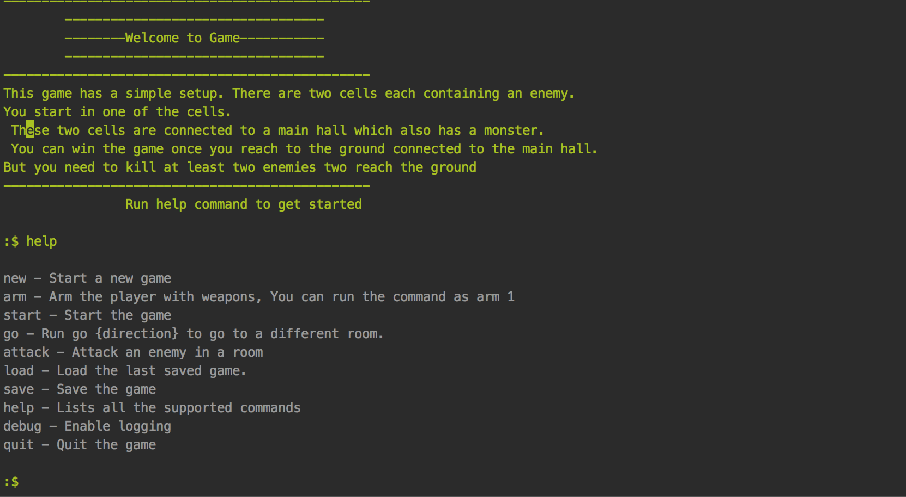
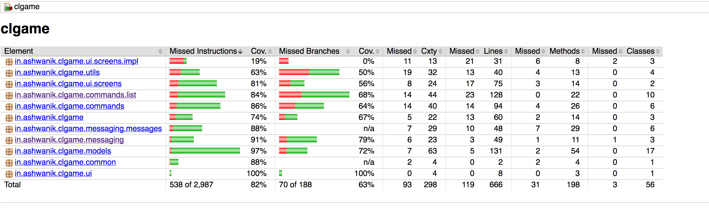

# command-line-game
A simple command line game in Java


Code coverage


# Build the game
```bash
./gradlew clean build
```

# Build the game with code coverage report
```bash
./gradlew clean build jacocoTestReport

```

# Run the game
```bash
java -jar build/libs/clgame-1.0-SNAPSHOT.jar 

```

# Next steps

1. We can add new weapons
2. We can create a whole castle full of keeps, rooms etc to add more complexity in the game.
